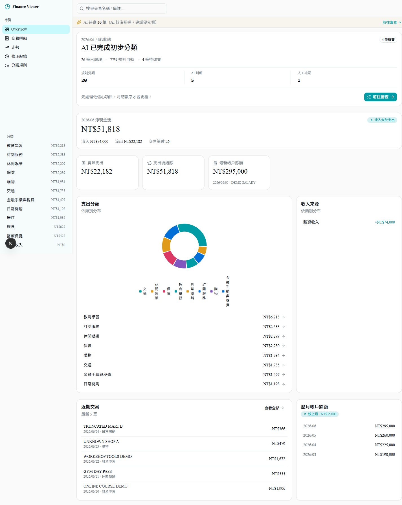

<p align="center">
  
</p>

# Finance Viewer

**AI-assisted finance review that stays under your control.**

Finance Viewer 幫你把雜亂帳單變成可審查、可修正、可累積規則的財務資料。AI 可以先讀帳單、補全商家、提出分類；最後由你在瀏覽器裡確認，讓每次修正都變成下次更準的依據。

## 產品介紹

這個工具服務的是一條很實際的帳單整理流程：**AI 負責整理，人負責判斷，系統負責記住。**

- **資料留在你手上**：帳單與修正紀錄留在本機，不需要交給雲端記帳服務保管。
- **AI 先整理，不替你拍板**：AI 可以讀帳單、查商家、提出分類與信心度；你只需要審最需要確認的地方。
- **審查是主要工作流**：低信心交易優先排序，讓你快速處理真正需要人類判斷的項目。
- **修正會累積成規則**：同一類商家不用每個月重判，系統會把你的決策沉澱成可套用的分類記憶。

它不是雲端記帳 SaaS，也不是內建 AI 的黑盒分類器；它是給 AI agent 使用的本機財務工作台，讓你保有資料、規則與審核權。技術細節和 API 契約放在下面，需要自動化時再看。

---

## 🤔 為什麼是這個架構？

市售記帳軟體把 AI 綁死在雲端：你用的是它選的模型、它的分類邏輯、它的伺服器，資料還得送上雲。**你不擁有任何一環。**

Finance Viewer 反過來 👇

| 痛點 | Finance Viewer 怎麼解 |
|---|---|
| AI 被綁特定模型 | **Bring Your Own Agent** — 不內建 AI，你用 Codex / Claude Code 透過乾淨 API 操作，隨時換最強的模型 |
| 資料不想上雲 | **100% 本機** — SQLite 在你電腦，AI 在你電腦，資料不離開 |
| AI 分類 + 人工校對兩頭跑 | AI 在外部產出 CSV / 打 API 批次處理，**人在 Web UI 拍板**，分工清楚 |
| 改過又忘 | 每次修正寫進 **append-only 的 correction_log**，AI 可讀它做「分類規則分析」 |
| 想知道錢花哪去 | **分類分析**（標準 14 類支出結構），AI 初分 + 人工終審 |
| UI 像上個世紀 | **shadcn/ui + Recharts**，現代、乾淨、手機也順 |

> 你的 AI、你的資料、你的規則。伺服器只是忠實的資料層與審核介面。

---

## ✨ 特色 Features

- 🤝 **外部 AI Agent 友善** — 完整 REST API + 操作 playbook（[`prompts/playbook.md`](./prompts/playbook.md)），Codex / Claude Code 直接打 API 匯入帳單、批次分類、產出分析
- 📅 **月結三幕** — 匯入後首頁直接告訴你：「26 筆已處理 · 77% 規則自動 · 只剩 4 筆等你審」→ 你的月報 → 系統變聰明了
- 🧾 **月報答案卡** — 本月 vs 常態（跟自己比，不用設預算）、Top movers（只浮出顯著變化）、固定底盤（連續出現的訂閱型支出）
- 📈 **規則自動化率曲線** — 每月的規則覆蓋率折線，「越用越省力」不是口號是圖表
- 🎯 **低信心優先審** — AI 沒把握的排最前面，每筆附一句人話判斷理由，你只審真正需要判斷的
- ⌨️ **鍵盤連續審查** — j/k 移動、c 確認、打字搜尋分類；依商家分組一次處理同店家，審完順手建規則
- 🔁 **修正回饋閉環** — 「你的 N 筆修正 → M 條規則 → 已自動處理 K 筆」，看得見自己教會了系統什麼
- ⚡ **批次修正** — AI 透過 API 批次改、或你在 UI 勾選改
- 🔍 **全文搜尋** — 交易名稱、備註、分類原因即時搜尋
- 📝 **修正歷史 = 學習資產** — `correction_log` append-only，trigger 阻擋竄改，是 AI 產出規則的原料
- 🔒 **安全第一** — CSP / X-Frame-Options 安全標頭 + import 路徑白名單 + 金額欄位無寫入路徑（不可竄改）
- 📱 **RWD** — 桌面、平板、手機都順

---

## 🧠 AI 在哪一端？（架構）

```
┌─────────────────────────┐        ┌─────────────────────────────────┐
│  你的 AI Agent（外部）   │        │  Finance Viewer Server（你架的） │
│  Codex / Claude Code    │        │  http://localhost:3127           │
│                         │  API   │                                  │
│  • 分析原始帳單 → CSV   │ ─────► │  POST /api/import-ledger         │
│  • 批次分類、產出規則    │ ─────► │  POST /api/transactions/batch    │
│  • 讀 correction_log    │ ◄───── │  GET  /api/corrections           │
│  • 月度分析報告          │ ◄───── │  GET  /api/summary /trend /...   │
└─────────────────────────┘        │                                  │
                                   │  Web UI（人工終審）              │
                                   │  逐筆校對 / 批次 / 下鑽          │
                                   └─────────────────────────────────┘
```

AI 看不到你的資料細節？錯 — **AI 就是你跑的 Codex/Claude Code**，資料在它讀得到的地方（你電腦），但它不經過任何第三方雲端。

---

## 🚀 快速開始 Quick Start

先用隔離的 demo DB 試跑，不會碰正式的 `data/finance.sqlite`：

macOS / Linux / Git Bash：

```bash
git clone https://github.com/cablate/finance-viewer
cd finance-viewer
npm install
FINANCE_DB_PATH=data/dev-demo.sqlite npm run seed:demo
FINANCE_DB_PATH=data/dev-demo.sqlite npm run dev
```

Windows PowerShell：

```powershell
git clone https://github.com/cablate/finance-viewer
cd finance-viewer
npm install
$env:FINANCE_DB_PATH="data/dev-demo.sqlite"
npm run seed:demo
npm run dev
```

打開 **http://localhost:3127**，你會看到 6 個月、156 筆示範交易的完整儀表板。

### Demo 畫面

**總覽（月結卡 + 你的月報）** — 一眼看到「已處理多少、剩幾筆待審、錢跟常態比花在哪」：



**規則自動化率** — 越用越省力的複利曲線：


**審查佇列** — 低信心排最前、附 AI 判斷理由、鍵盤連續審：


### 用你自己的帳單

正式使用時，啟動 server 後把帳單檔案交給你慣用的 AI agent（Codex、Claude Code 等）。如果你剛剛在同一個 PowerShell 視窗跑 demo，先關掉 dev server，另開新終端或清掉 `FINANCE_DB_PATH`，讓正式資料進預設的 `data/finance.sqlite`。

把這段貼給 AI：

```text
我架好了 Finance Viewer（localhost:3127），請讀專案的 prompts/playbook.md，照流程 A 處理我這份帳單：<檔案路徑>
```

AI 會依 playbook 解析帳單、補全商家資訊、產生 ledger CSV、匯入本機 API，並把低信心交易留給你在 Web UI 審查。

如果你已經有整理好的 ledger CSV，也可以直接匯入：

```bash
npm run seed -- --ledger=path/to/your/ledger.csv
# 或讓你的 AI agent 打 POST /api/import-ledger
```

---

## 🖥 使用方式 Usage

1. **匯入** — AI 分析帳單產出 CSV → 匯入（CLI 或 API）
2. **總覽** — 月結卡看「已處理 / 自動化率 / 待審數」，月報看 本月 vs 常態 / Top movers / 固定底盤，點卡可**下鑽**
3. **審查** — 一鍵帶到低信心交易（附 AI 判斷理由），鍵盤 j/k/c 連續審，或依商家分組一次處理同店家
4. **修正** — 改 分類/備註 → 儲存（寫進 correction_log）；改完同商家可順手建規則
5. **批次** — UI 勾選 或 AI 透過 API 批次改
6. **AI 後續分析** — AI 讀 `/api/corrections` 進化規則（修正紀錄頁會顯示「你的修正 → 規則 → 自動處理了幾筆」）、讀 `/api/summary` 做月報

---

## 📡 API — 給你的 AI Agent 用

> 完整契約與 SOP 見 [`prompts/playbook.md`](./prompts/playbook.md)；開發規則見 [`AGENTS.md`](./AGENTS.md)。本機同源 `http://localhost:3127/api/*`、統一錯誤 envelope。

| Method | Route | 用途 |
|---|---|---|
| GET | `/api/summary` `/breakdown` `/trend` `/transactions` `/spending` `/corrections` `/balance-history` `/meta` `/health` | 查詢（AI 讀這些做分析；`/api/meta` 含 needsReview 待審計數） |
| GET | `/api/transactions/:id` | 單筆明細 |
| PATCH | `/api/transactions/:id` | 單筆修正（白名單欄位） |
| POST | `/api/transactions/batch` | 批次修正（AI 批次處理） |
| POST | `/api/transactions/review` | 批次標記已審（人類認可規則套用） |
| GET | `/api/rules` `/rules/:id` `/rules/normalize` | 規則查詢／正規化預覽 |
| POST | `/api/rules` | 新增規則（帶 confidence） |
| PATCH/DELETE | `/api/rules/:id` | 改／刪規則 |
| POST | `/api/import-ledger` | 匯入 CSV（csvPath 白名單） |

---

## 🛠 技術棧 Tech Stack


| 層 | 技術 |
|---|---|
| Framework | **Next.js 15** (App Router) + **React 19** |
| UI | **shadcn/ui** (radix-nova) + **Tailwind CSS v4** + **lucide-react** |
| 圖表 | **Recharts** |
| 資料庫 | **node:sqlite**（Node 22 內建，零外部依賴） |
| 金額 | **INTEGER cents**（元 ×100，消除浮點累積誤差） |

---

## 🏗 架構 Architecture

```
finance-viewer/
├─ app/            (app)/ route group（共享 layout + 5 個 page：/ /transactions /trend /corrections /rules）+ API routes + root layout
├─ components/     Overview(月結卡+月報答案卡) · TransactionTable(鍵盤審查+分組+批次+建規則)
│                  · RulesManager(規則 CRUD+normalize 預覽) · CorrectionsLog(修正回饋閉環)
│                  · TrendView(自動化率曲線) · AppSidebar · SearchInput · AIBanner · charts/
├─ lib/            db（單例）· queries/（core/transactions/rules/corrections 子模組）· normalize · constants
│                  · format（cents/100）· api-client · hooks · utils
├─ test/           normalize（match_key 行為鎖）· import dedupe
├─ middleware.js   安全標頭（CSP / X-Frame-Options / nosniff / Referrer-Policy）
├─ AGENTS.md       給 AI 編程助手的開發規則（改碼時遵守的不變量與分析角度）
├─ prompts/        playbook.md — 外部 AI Agent（Codex/Claude Code）操作契約 + SOP
├─ scripts/        seed-from-ledger.js · seed-demo.js · verify-release.mjs
├─ docs/           screenshots/ · brand/
└─ data/           finance.sqlite（本機，gitignore 不追蹤）
```

### 設計原則
1. **人先確認，AI 才學** — 未確認的不會變成規則
2. **外部 AI 初分、人工終審** — AI 在外部產出含初分的 CSV / 打 API 批次處理，人在 Web UI 拍板
3. **不雙向同步** — 匯入不會覆蓋人工已改的分類
4. **金額不可端改** — 金額欄位完全沒有 UPDATE 路徑
5. **修正軌跡 append-only** — `correction_log` 有 trigger 阻擋 UPDATE/DELETE

---

## ☁️ 部署 Deploy

### 本機（推薦 ✅，隱私最佳）
```bash
npm run build && npm run start    # → http://localhost:3127
```
AI agent（Codex/Claude Code）與 server 都在你電腦，資料不外流。

### 雲端（Vercel / 自架）
這是**本機工具**：DB 是本機 SQLite、API 無身份驗證（設計為單人本機 + 本機 AI agent）。要部署雲端需：換雲端 DB、加身份驗證、確認安全標頭與 import 白名單。

---

## 🔐 隱私 Privacy

**100% 本機。** 你的銀行帳單與你的 AI 都在你電腦 —— 不上傳、不分析、不回報。
SQLite 在 `data/finance.sqlite`，隨時可 `rm` 或備份。

---

## 🧰 開發 Development

```bash
npm run dev              # 開發（hot-reload）
npm run build            # 生產 build
npm test                 # 關鍵路徑測試（normalize match_key 行為鎖 + import dedupe）
npm run verify:release   # 一鍵 release 驗收（test + build + 殘留掃描 + demo 敘事指標 + 截圖檢查）
npm run seed:demo:reset  # 重建示範資料（會清空既有 DB）
npm run lint             # ESLint
```

需求 Node ≥ 22.5（`node:sqlite` 內建）。開發時用 `FINANCE_DB_PATH=data/dev-demo.sqlite` 指到隔離的 demo 庫，避免動到正式資料。

---

## 📜 授權 License

MIT — 自由使用、修改、散布、商用。

---

## 🤝 貢獻 Contributing

PR welcome。特別歡迎：**其他銀行的帳單格式經驗**（補充 `prompts/playbook.md` 的銀行特性段）。

**未來方向**（roadmap）：
- **個人／事業維度**：objective 維度走既有規則系統加回（design note 已在 AGENTS.md 維度設計判準）
- **AI 月度洞察報告**：閒置訂閱、佔比變化、可優化清單——聚合層洞察，不逐筆評判
- **分類清單可配置化**：`lib/constants.js` 的 14 類移到 config，各人自訂分類體系
- **銀行別 playbook adapter**：把銀行特性段抽成獨立檔，社群貢獻各銀行格式
- export／備份指令、optional API token（NAS／多裝置場景）

---

<div align="center">

**你的 AI，你的資料，你的伺服器。** 💪

</div>
